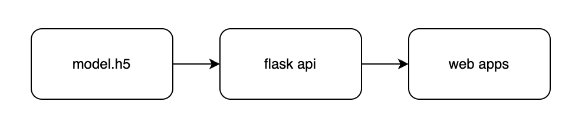
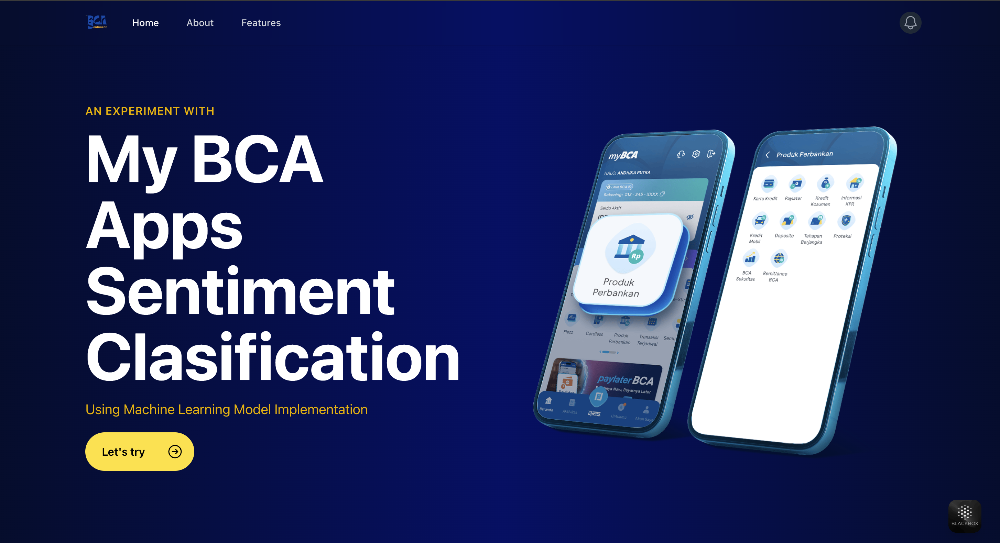
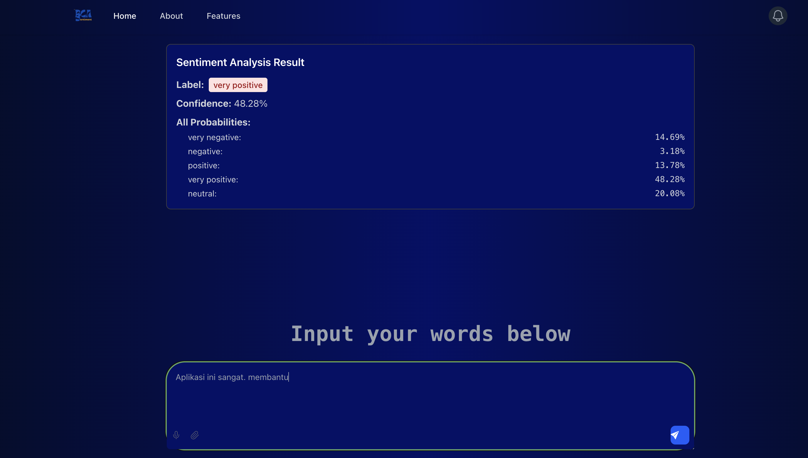

# Sentiment Classification Web Apps (myBCA apps Sentiment Classification)

## 1. 🧠 Introduction

This project is a sentiment classification web application built to analyze user reviews of the **myBCA** mobile app. The goal is to automate sentiment analysis using an LSTM-based deep learning model and to provide an integrated web system with both backend and frontend components.

---

## 2. 🔁 Web Workflow:

*A visual flowchart will be provided.*



---

## 3. ⚙️ Install Dependencies and Set Up Environment

### 🔹 Build the Model (LSTM)
The sentiment classification model is developed using **Google Colab**. Make sure the following libraries are installed:

- `pandas`, `numpy`, `matplotlib`, `seaborn`  
- `tensorflow`, `keras`  
- `scikit-learn`  
- `Sastrawi` (Indonesian NLP library)  
- `wordcloud`  

### 🔹 Backend (Flask)
Navigate to the `backend` folder and run:
```bash
pip install -r requirements.txt
python app.py
````

### 🔹 Frontend (Vite + React)

Navigate to the `frontend` folder and run:

```bash
npm install
npm run dev
```

---

## 4. 📥 Clone This Repository

```bash
git clone https://github.com/Yogabut/sentiment-classification-web-apps.git
```

---

## 5. 🌐 Website Preview

Preview images and UI screens can be found in the following folder:





---

## 6. 🛠️ Tools Used

* **Google Colab** — For training and experimenting with the ML model
* **Visual Studio Code** — As the main development editor for backend and frontend
* **Spreadsheet** — Used for annotating and preparing sentiment-labeled datasets
* **GitHub** — For source code management and collaboration

---

## 7. 🚀 Tech Stack

### 🔍 Build ML Model

* pandas
* numpy
* matplotlib
* seaborn
* TensorFlow
* Keras
* Sastrawi
* scikit-learn
* wordcloud

### 🖥️ Backend

* Flask
* FastAPI *(optional for future enhancements)*

### 💻 Frontend

* Vite
* React
* TailwindCSS

---

Built with ❤️ by [@Yogabut](https://github.com/Yogabut)

